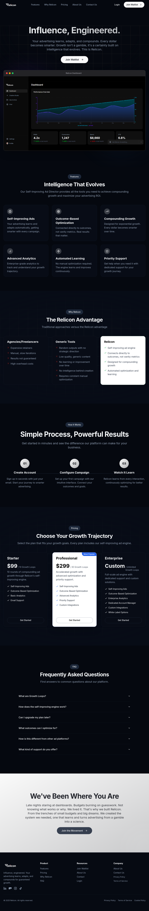

# Relicon - AI Advertising Director

<p align="center">
  
</p>
## Tech Stack

**Frontend:**
- Next.js 14 (App Router)
- React 18
- TypeScript
- Tailwind CSS
- Shadcn/ui components

**Backend:**
- FastAPI (Python 3.11)
- PostgreSQL database
- AI Services:
  - OpenAI GPT-4o
  - Luma AI Ray-2
  - ElevenLabs TTS & Music

## Getting Started

### Prerequisites

- Node.js 18+ and pnpm
- Python 3.11
- PostgreSQL database
- API Keys: OPENAI_API_KEY, LUMA_API_KEY, ELEVENLABS_API_KEY

### Installation

```bash
# Install dependencies
pnpm install

# Start development servers
pnpm dev              # Frontend on port 5000
cd engine && python server.py  # Backend on port 8000
```

### Environment Variables

Required secrets:
- `DATABASE_URL` - PostgreSQL connection
- `OPENAI_API_KEY` - GPT-4o API key
- `LUMA_API_KEY` - Luma AI API key (Ray-2 model)
- `ELEVENLABS_API_KEY` - ElevenLabs API key

## Project Structure

```
├── app/                  # Next.js pages
│   ├── dashboard/       # Dashboard section
│   │   ├── studio/     # Creative Studio
│   │   ├── ads/        # Ads archive
│   │   └── chat/       # AI assistant
│   └── api/            # API routes
├── components/          # React components
├── engine/             # AI ad generation backend
│   ├── core/          # Services (orchestrator, planning, video, audio)
│   ├── providers/     # AI providers (OpenAI, Luma, ElevenLabs)
│   ├── config/        # Configuration
│   └── server.py      # FastAPI server
└── public/            # Static assets

```

## License

Proprietary - All rights reserved
